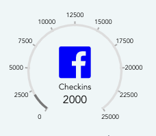

# gauge

Work In Progress. This gauge will allow any range and any set of values. It will be responsive, enabling it to be used in any size area. When fully implemented, it will take in a range from min to max. It iwll have an assortment of controls within the center of the gauge and will allow an image to be placed in the center of the gauge.
Here is the current screenshot: (Updated as I progress)



## Project setup
```
npm install
```

### Compiles and hot-reloads for development
```
npm run serve
```

### Compiles and minifies for production
```
npm run build
```

### Run your tests
```
npm run test
```

### Lints and fixes files
```
npm run lint
```
